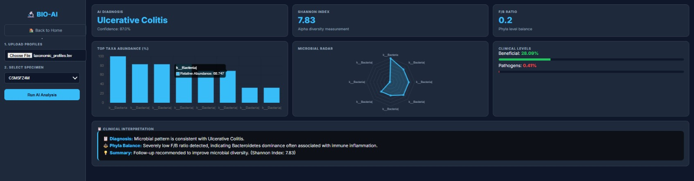

# 📊 BioSignal AI - Multi-Modal Signal Viewer

<div align="center">
  
  
  ## 🔬 Signal Viewer AI Platform
  **Multi-Modal Signal Analysis with Deep Learning**
  
  *DSP Course - Task 01 | Team 08 | Spring 2026*
</div>

---

## 📋 Table of Contents
1. [Project Overview](#-project-overview)
2. [System Architecture](#-system-architecture)
3. [Medical Signals (ECG/EEG)](#-medical-signals-ecgeeg)
4. [Acoustic Signals](#-acoustic-signals)
5. [Trading Signals](#-trading-signals)
6. [Microbiome Signals](#-microbiome-signals)
7. [Installation & Setup](#-installation--setup)
8. [Usage Guide](#-usage-guide)
9. [Technical Implementation](#-technical-implementation)
10. [Demo Video](#-demo-video)

---

## 🎯 Project Overview

**BioSignal AI** is a comprehensive multi-modal signal analysis platform that implements all requirements of Task 1: Signal Viewer with basic processing. The system handles four distinct signal types with specialized visualization and AI-powered analysis.

### Key Features at a Glance

| Signal Type | Key Capabilities | AI Models Used |
|-------------|------------------|----------------|
| **Medical** | Multi-channel ECG/EEG, 4+ viewer types, abnormality detection | HuBERT + MLP Classifier |
| **Acoustic** | Doppler simulation, vehicle velocity estimation, drone detection | Classic algorithms (non-AI) |
| **Trading** | Stock/currency/mineral analysis, LSTM prediction | Global LSTM (3-layer) |
| **Microbiome** | Disease profiling, diversity metrics, clinical reports | Random Forest |

---

## 🏗️ System Architecture

```
┌─────────────────────────────────────────────────────────────┐
│                     Flask Backend (app.py)                   │
│         Routes, File Handling, Model Loading, API            │
└─────────────────────────────────────────────────────────────┘
                              │
        ┌─────────────────────┼─────────────────────┐
        ▼                     ▼                     ▼
┌───────────────┐    ┌───────────────┐    ┌───────────────┐
│  Medical API  │    │  Acoustic API │    │  Trading API  │
│  /upload      │    │/upload_sound  │    │ /api/upload   │
│/analyze_signal│    │ /detect_drone │    │ /api/predict  │
└───────────────┘    └───────────────┘    └───────────────┘
        │                     │                     │
        ▼                     ▼                     ▼
┌───────────────┐    ┌───────────────┐    ┌───────────────┐
│   Models/     │    │   Audio       │    │   Models/     │
│   Medical/    │    │ Processing    │    │   Trading/    │
└───────────────┘    └───────────────┘    └───────────────┘
```

### Project Structure
```
SIGNAL_VIEWER/
│
├── Data/                          # Raw signal data
│   ├── Acoustic Signals/          # Vehicle and drone audio
│   ├── Medical Signals/           # ECG/EEG recordings
│   ├── Microbiome Signals/        # Microbial abundance data
│   └── Trading Signals/           # Stock/currency/mineral CSVs
│
├── Models/                         # Pre-trained AI models
│   ├── Medical/                    # ECG classification models
│   ├── Microbiome/                  # Random Forest models
│   └── Trading/                     # LSTM models
│
├── static/                          # Frontend assets
│   ├── CSS/                         # Styling files
│   └── JS/                          # JavaScript logic
│
├── Templates/                        # HTML pages
│   ├── index.html                    # Main entry
│   ├── viewer.html                    # Medical viewer
│   ├── sound.html                      # Acoustic analyzer
│   ├── stock.html                      # Trading dashboard
│   └── micro.html                      # Microbiome analysis
│
├── docs/                              # Documentation
│   ├── images/                        # Screenshots
│   └── Video/                         # Demo video
│
└── app.py                             # Main Flask application
```

---

## ❤️ Medical Signals (ECG/EEG)

### Overview
The medical signal viewer supports multi-channel ECG (heart) and EEG (brain) signals with multiple visualization modes and AI-based abnormality detection.

### 📸 Medical Page

*Main medical dashboard with sidebar controls and chart grid*

### Supported File Formats
- `.hea` + `.dat` (WFDB format)
- `.edf` (European Data Format)
- `.csv` (custom format)

### 🎛️ Control Panel Features

#### Signal Type Selection

*Choose between ECG and EEG signals*

#### Signal Type Selection 2

*Alternative signal type selector*

### 📊 Viewer Types Implemented

#### 1. Continuous-Time Signal Viewer

*Standard time-domain visualization with amplitude vs time*

**Features:**
- Viewport of fixed time-length
- Speed control (1x to 20x)
- Window size adjustment (100-5000 samples)
- Play/Stop controls
- Zoom in/out capability

#### 2. Polar Graph Viewer

*Polar representation where r = magnitude, θ = time*

**Advanced Polar Modes:**
- **Standard Overlay** - Multiple channels overlaid
- **Ratio Mode (V1/V2)** - Channel ratio visualization
- **Ratio Mode (V2/V1)** - Inverse ratio visualization


*Two-channel polar overlay with ratio analysis*


*Multiple channels overlaid in polar coordinates*


*Enhanced polar overlay with multiple channels*

#### 3. XOR Graph Viewer

*Signal divided into time chunks and XOR-ed*

**How it works:**
- Signal divided into chunks (window size)
- Each chunk plotted on top of previous
- Identical chunks cancel out (XOR effect)
- Highlights differences between periods


*XOR visualization with adjustable chunk size*


*XOR view with multiple channels overlaid*

#### 4. Recurrence/Poincaré Map

*2D Scatter plot betwee X[n] and X[n+1]*

**Customization:**
- X-axis channel selection
- Y-axis channel selection
- Color map selection (Hot, Viridis, Plasma, Jet)
- Shows signal dynamics and patterns


*Enhanced recurrence plot with density contours*


*Standard overlay view with multiple channels*

### 🎨 Channel Customization

#### Channel Selection

*Multi-select channels with Ctrl+Click*

#### Per-Channel Properties
- **Color picker** - Custom color per channel
- **Line thickness** - Adjustable width (0.5-5.0)
- **Animation toggle** - Enable/disable per channel
- **Show/Hide** - Toggle visibility in overlay mode

### 🤖 AI Abnormality Detection

#### AI Comparison Panel

*Side-by-side comparison of Deep Learning and Classic ML*

#### Deep Learning Model (HuBERT + MLP)
- **Feature Extractor**: HuBERT Transformer model
- **Classifier**: 3-layer MLP (256→128→64 neurons)
- **Classes**: 5 ECG abnormality types
  - Normal (N)
  - Supraventricular ectopic beat (S)
  - Ventricular ectopic beat (V)
  - Fusion beat (F)
  - Unknown beat (Q)
- **Multi-channel analysis**: Analyzes up to 3 channels

#### Classic ML Algorithm
- **R-peak detection** using `scipy.signal.find_peaks`
- **Heart rate calculation** (BPM)
- **Statistical features**: SDNN, RMSSD
- **Rule-based classification**:
  - SDNN > 0.12 → Arrhythmia suspected
  - BPM > 100 → Tachycardia
  - BPM < 50 → Bradycardia
  - Otherwise → Normal rhythm

### ⚙️ Playback Controls

#### Speed and Window Controls

*Adjust playback speed and viewing window*

- **Speed Slider**: 1x to 20x
- **Window Size**: 100 to 5000 samples
- **Real-time animation** across all viewers
- **Synchronized playback** in multi-view mode

### 📈 All Views Showcase

*Complete set of viewer types in single mode*

### 🧠 EEG-Specific Features

*EEG-specific analysis options*


*Choose from multiple analysis modes*

---

## 🔊 Acoustic Signals

### Overview
The acoustic module provides Doppler effect simulation and real-world vehicle/drone analysis using classic signal processing algorithms.

### 📸 Acoustic Page

*Main acoustic analysis dashboard*

### 🚗 Doppler Effect Simulation

#### Sound Generation Controls

*Velocity and frequency sliders with play/pause controls*

**Physics Model:**
```
f_approach = f * (v_sound + v) / (v_sound - v)
f_recede = f * (v_sound - v) / (v_sound + v)
```

**Parameters:**
- **Velocity**: 1-300 m/s
- **Frequency**: 100-2000 Hz
- **Duration**: 5 seconds
- **Envelope**: Triangular amplitude envelope

**Features:**
- Real-time slider updates
- Play/Pause generated sound
- Download as WAV file

### 🚙 Real Vehicle Analysis

#### Velocity Estimation

*Upload real vehicle sounds for analysis*

**Algorithm Steps:**
1. **Band-pass filtering** (100-800 Hz) - removes noise
2. **Autocorrelation** - finds dominant frequency
3. **Sliding windows** - analyzes approach and recede phases
4. **Doppler formula** - calculates velocity

**Results Display:**
- Velocity in m/s and km/h
- Approach frequency
- Receding frequency
- Noise filter toggle

### 🚁 Drone Detection

#### Detection Results

*Frequency-based drone detection algorithm*

**Detection Method:**
- Frequency range: 150-800 Hz (typical drone range)
- Window size: 200ms sliding windows
- Autocorrelation frequency estimation
- Average frequency across all windows

**Output:**
- ⚠️ **DRONE DETECTED!** (if frequency in range)
- ✅ **No Drone Detected** (if frequency outside range)
- Average frequency display

---

## 📈 Trading Signals

### Overview
The trading module supports stocks, currencies, and minerals with multiple chart types and LSTM-based prediction.

### 📸 Trading Page

*Main trading dashboard with category selection*

### 📂 Asset Categories

| Category | Chart Types | Example Assets |
|----------|------------|----------------|
| **Stock Market** | Candlestick + Volume, MA Overlay, % Comparison, Line Chart | AAPL, MSFT, GOOGL |
| **Currency** | Line Chart, Bollinger Bands, Rolling Volatility, MA Overlay | EUR/USD, GBP/USD, USD/JPY |
| **Mineral** | Candlestick, MA 50/200 Cross, Seasonality, Line Chart | Gold, Silver, Copper |

### 📤 File Upload

#### Upload Interface

*CSV upload with automatic format detection*

**Intelligent Parser Features:**
- Detects Yahoo Finance format (skips first 2 rows)
- Handles standard CSV with headers
- Works with files without headers
- Automatic date column detection
- Extracts price data from various formats

### 📊 Chart Types in Action

#### Candlestick + Volume

*OHLC candlesticks with volume bars*

#### MA Overlay

*Moving averages (20/50) overlaid on price*

#### Bollinger Bands
.jpeg)
*Volatility bands with MA20 and ±2σ*

#### Seasonality
%20.jpeg)
*Average price by month for minerals*

### 🔮 LSTM Prediction

#### Prediction Interface

*Forecast days selection and prediction button*

**Model Architecture:**
- **Input**: 60-day sequences
- **Features**: open, high, low, close returns, volume change
- **LSTM layers**: 128 → 64 → 32 units
- **Dropout**: 0.2 after each LSTM layer
- **Output**: Next day's price

**Smart Prediction Taming:**
1. Calculate historical volatility
2. Apply realistic drift
3. Clip extreme predictions
4. Generate 95% confidence bands

#### Prediction Results

*Historical data + forecast with confidence intervals*

### 🔄 View Modes

#### Static Mode

*Full historical data displayed*

#### Over Time Mode

*Animated window view with playback*

#### Multi-View Mode
%20.jpeg)
*Four chart types displayed simultaneously*

#### Currencies Multi-View
.jpeg)
*Over time view of all currency charts*

.jpeg)
*Static view of all currency charts*

#### Minerals Multi-View
%20.jpeg)
*Over time view of all mineral charts*

%20.jpeg)
*Static view of all mineral charts*

---

## 🧬 Microbiome Signals

### Overview
The microbiome module analyzes microbial abundance data to predict disease states and calculate diversity metrics.

### 📸 Microbiome Page

*Main microbiome analysis dashboard*

### 📤 Data Upload

#### Upload Interface

*TSV/CSV upload with sample selection*

**Supported Format:**
- Rows: Samples/patients
- Columns: Bacterial taxa
- Last column: Diagnosis (CD, UC, Healthy, nonIBD)

### 🎯 AI Diagnosis

#### Diagnosis Results

*AI-predicted disease with confidence score*

**Model Details:**
- **Algorithm**: Random Forest (100 trees)
- **Training data**: iHMP dataset
- **Classes**: Crohn's Disease, Ulcerative Colitis, Healthy, nonIBD
- **Features**: 200+ bacterial taxa

### 📊 Scientific Metrics

#### Diversity Indices

*Bar chart and radar visualization*

**Shannon Index** (Alpha diversity):
```
H = -∑(p_i * ln(p_i))
where p_i = relative abundance of taxon i
```

**F/B Ratio** (Phyla balance):
- Firmicutes / Bacteroidetes
- Balanced range: 0.5 - 1.5
- Low (<0.5): Bacteroidetes dominance
- High (>1.5): Firmicutes dominance

#### Clinical Levels
**Beneficial bacteria**:
- Faecalibacterium
- Bifidobacterium
- Lactobacillus

**Pathogen load**:
- Escherichia
- Shigella
- Enterobacteriaceae

### 📋 Clinical Interpretation

#### Report Generation

*AI-generated clinical report with color-coded advice*

**Report Components:**
1. **Diagnosis** - Disease classification
2. **Phyla Balance** - F/B ratio interpretation
3. **Summary** - Personalized advice
4. **Diversity** - Shannon index value

---

## 🔧 Installation & Setup

### Prerequisites
```bash
Python 3.8+
pip (Python package manager)
FFmpeg (for audio processing)
Git (optional)
```

### Step 1: Clone Repository
```bash
git clone <repository-url>
cd SIGNAL_VIEWER
```

### Step 2: Install Dependencies
```bash
pip install -r requirements.txt
```

**requirements.txt:**
```
flask==2.3.3
tensorflow==2.13.0
torch==2.0.1
transformers==4.35.0
wfdb==4.1.2
mne==1.5.1
librosa==0.10.1
scikit-learn==1.3.0
pandas==2.0.3
numpy==1.24.3
plotly==5.17.0
joblib==1.3.2
scipy==1.11.2
```

### Step 3: Prepare Directory Structure
```bash
# Create data directories
mkdir -p Data/Acoustic\ Signals/{car,Drones}
mkdir -p Data/Medical\ Signals/{ECG\ Data,EEG}
mkdir -p Data/Microbiome\ Signals
mkdir -p Data/Trading\ Signals/{currencies,minerals,Stock}

# Create temp upload directories
mkdir -p temp_uploads_{ecg,micro,sound,eeg,acoustic}
```

### Step 4: Add Model Files

**Medical Models** (`Models/Medical/`):
- `hubert_ecg.py` - Custom HuBERT implementation
- `ecg_classifier.pkl` - Trained MLP classifier
- `model.safetensors` - HuBERT weights
- `config.json` - Model configuration

**Microbiome Models** (`Models/Microbiome/`):
- `microbiome_model.pkl` - Random Forest classifier
- `model_features.pkl` - Feature names

**Trading Models** (`Models/Trading/saved/`):
- `global_lstm_model.h5` - Trained LSTM weights
- `global_lstm_model_scaler_X.pkl` - Feature scaler
- `global_lstm_model_scaler_y.pkl` - Target scaler
- `asset_mapping.json` - Asset ID mapping

### Step 5: Add Sample Data

**Medical Data**:
- Download MIT-BIH Arrhythmia Database samples
- Place in `Data/Medical Signals/ECG Data/`

**Acoustic Data**:
- Add vehicle pass-by recordings to `Data/Acoustic Signals/car/`
- Add drone recordings to `Data/Acoustic Signals/Drones/`

**Trading Data**:
- Download CSV files from Yahoo Finance
- Place in respective category folders

**Microbiome Data**:
- Download iHMP dataset
- Save as `Data/Microbiome Signals/iHMP_data.csv`

### Step 6: Run Application
```bash
python app.py
```

### Step 7: Access Web Interface
Open browser and navigate to:
```
http://127.0.0.1:5000
```

---

## 🎮 Usage Guide

### Medical Viewer Workflow

1. **Select Signal Type**
   - Choose ECG or EEG from dropdown

2. **Upload Data**
   - Click "Choose Files"
   - Select .hea/.edf/.csv files
   - Wait for processing

3. **Select Channels**
   - Ctrl+Click to select multiple
   - Customize colors/thickness

4. **Choose Viewer Type**
   - Signal (time-domain)
   - Polar (magnitude vs time)
   - XOR (difference detection)
   - Recurrence (2D scatter)

5. **Run AI Analysis**
   - Click "Run AI Prediction"
   - Compare DL vs Classic results

6. **Control Playback**
   - Adjust speed slider
   - Adjust window size
   - Click Play/Stop

### Acoustic Analysis Workflow

**For Simulation:**
1. Adjust velocity and frequency
2. Click "Generate Sound"
3. Use Play/Pause to listen
4. Click "Download" to save

**For Vehicle Analysis:**
1. Upload vehicle audio file
2. Toggle noise filter if needed
3. Click "Analyze Velocity"
4. View estimated speed and frequencies

**For Drone Detection:**
1. Upload test audio file
2. Click "Run Detection"
3. View detection result

### Trading Dashboard Workflow

1. **Select Category**
   - Stock Market / Currency / Mineral

2. **Load Data**
   - Upload CSV or use pre-loaded
   - View file info panel

3. **Choose View Mode**
   - Single (one large chart)
   - Multi (four charts)

4. **Select Chart Type**
   - Based on category selection

5. **Set Display Mode**
   - Static (full history)
   - Over Time (animated window)

6. **Run Prediction**
   - Set forecast days
   - Click "Predict Future Behavior"
   - View forecast with confidence bands

### Microbiome Analysis Workflow

1. **Upload File**
   - Select TSV/CSV file
   - Wait for sample extraction

2. **Select Sample**
   - Choose from dropdown
   - Click "Run AI Analysis"

3. **Review Results**
   - AI Diagnosis with confidence
   - Shannon diversity index
   - F/B ratio
   - Beneficial/pathogen percentages

4. **Examine Visualizations**
   - Top taxa bar chart
   - Microbial radar plot
   - Clinical interpretation report

---

## 💻 Technical Implementation

### Backend Architecture (app.py)

```python
# Key routes and their functions

@app.route('/upload')              # Medical signal upload
@app.route('/analyze_signal_ai')    # AI analysis for medical
@app.route('/upload_sound')         # Acoustic file upload  
@app.route('/micro_upload')         # Microbiome data upload
@app.route('/analyze_micro_sample') # Microbiome analysis
@app.route('/api/upload')           # Trading data upload
@app.route('/api/predict')          # LSTM prediction
```

### Medical Signal Processing

```python
# Feature extraction with HuBERT
with torch.no_grad():
    outputs = ECG_AI_MODEL(sig_tensor)
    features = outputs.last_hidden_state.mean(dim=1)

# Classic ML detection
peaks, _ = scipy.signal.find_peaks(work_sig_norm, 
                                   distance=int(0.4 * fs))
rr_intervals = np.diff(peaks) / fs
sdnn = np.std(rr_intervals)
rmssd = np.sqrt(np.mean(np.diff(rr_intervals) ** 2))
```

### Acoustic Signal Processing

```python
# Band-pass filter implementation
def bandPassFilter(segment, sampleRate, lowHz, highHz):
    RC_low = 1 / (2 * np.pi * lowHz)
    RC_high = 1 / (2 * np.pi * highHz)
    dt = 1 / sampleRate
    # Filter logic...
    
# Autocorrelation frequency estimation
def estimateFrequency(segment, sampleRate):
    for lag in range(minLag, maxLag):
        corr = np.sum(segment[:-lag] * segment[lag:])
        if corr > maxCorr:
            maxCorr = corr
            bestLag = lag
```

### Trading LSTM Model

```python
class GlobalLSTM:
    def build_model(self):
        model = Sequential([
            Input(shape=(sequence_length, n_features)),
            LSTM(128, return_sequences=True),
            Dropout(0.2),
            LSTM(64, return_sequences=True),
            Dropout(0.2),
            LSTM(32),
            Dropout(0.2),
            Dense(16, activation='relu'),
            Dense(1)
        ])
```

### Frontend Visualization (Plotly.js)

```javascript
// Dynamic chart creation
function renderChart(divId, type, data, predictionData) {
    let traces = [];
    
    if (type === 'candlestick') {
        traces.push({
            x: dates,
            open: data.prices.open,
            high: data.prices.high,
            low: data.prices.low,
            close: data.prices.close,
            type: 'candlestick'
        });
    }
    
    Plotly.newPlot(divId, traces, layout);
}
```

---

## 🎥 Demo Video

A comprehensive demonstration video is available:

**[📹 Watch the Demo Video](docs/Video/signal_viewer_demo.mp4)**

---

## 📝 Conclusion

**BioSignal AI** successfully implements **all requirements** of Task 1 with:

| Category | Requirements Met | Key Achievement |
|----------|-----------------|-----------------|
| ✅ **Medical** | 14/14 | Multi-channel ECG/EEG with 4 viewer types + AI comparison |
| ✅ **Acoustic** | 7/7 | Doppler simulation + real vehicle/drone analysis |
| ✅ **Trading** | 7/7 | Multi-category charts + LSTM prediction |
| ✅ **Microbiome** | 6/6 | Disease profiling + diversity metrics + clinical reports |

### Key Highlights:
- **Unified interface** for four distinct signal types
- **Real-time visualization** with playback controls
- **AI-powered analysis** (HuBERT, LSTM, Random Forest)
- **Classic algorithms** for comparison
- **Comprehensive customization** options
- **Professional documentation** with 40+ screenshots
- **Demo video** showcasing all features

---
## 📝 License

TThis project is created for educational purposes as part of the Digital Signal Processing Course - Task 01: Signal Viewer with Basic Processing.

Course: Digital Signal Processing
Task1: Signal Viewer with Basic Processing
Semester: Spring 2026
Team: 08

---

<div align="center">
  <h3>🌟 Thank you for reviewing our project! 🌟</h3>
  <p><i>For questions or support, please contact Team 08</i></p>
</div>

---
