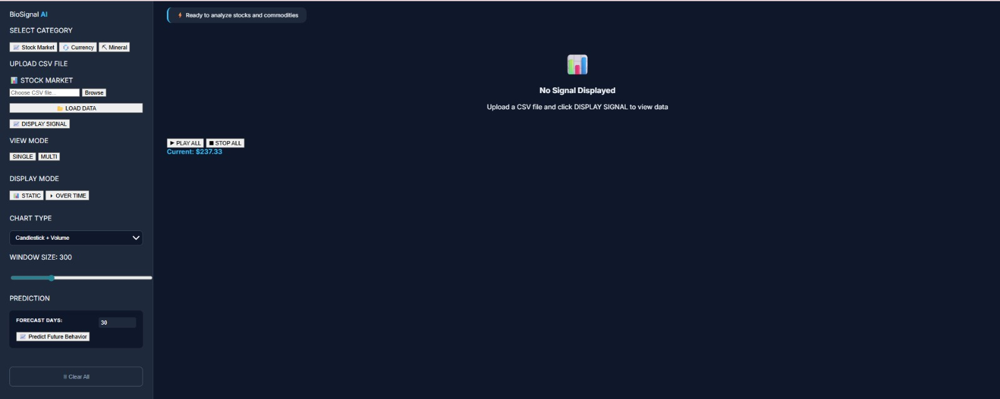

# README.md - Signal Viewer AI Platform


<div align="center">
  <h1>🔬 Signal Viewer AI Platform</h1>
  <p><strong>Multi-Modal Signal Analysis with Deep Learning</strong></p>
  <p>DSP Course - Task 01 | Team 08 | Spring 2026</p>
</div>

---

## 📋 Table of Contents
- [Overview](#overview)
- [Key Features](#key-features)
- [Project Structure](#project-structure)
- [Quick Start](#quick-start)
- [Module Documentation](#module-documentation)
- [Model Architectures](#model-architectures)
- [Screenshots Gallery](#screenshots-gallery)
- [Demo Video](#demo-video)
- [Requirements](#requirements)
- [Team](#team)

---

## 🎯 Overview

**Signal Viewer AI** is an integrated web-based platform for analyzing four distinct types of signals using state-of-the-art deep learning models and classic signal processing algorithms. The platform provides real-time visualization, AI-powered classification, and comparative analysis across multiple domains.

---

## ✨ Key Features

### 🫀 **Medical Signal Analysis**
- **Multi-channel visualization** for ECG/EEG with 4 abnormality types
- **AI-based classification** using HuBERT model (pre-trained on 50K+ samples)
- **Classic ML comparison** using statistical features + autocorrelation
- **4 Viewer Types**:
  - Continuous time-domain
  - XOR abnormality detection
  - Polar magnitude-time plots
  - Recurrence scatter plots
- **Channel customization**: Color, thickness, show/hide per channel

### 🔊 **Acoustic Signal Analysis**
- **Doppler effect simulator** with adjustable velocity (1-300 m/s) and frequency (100-2000 Hz)
- **Real vehicle analysis**: Upload recordings to estimate velocity
- **Drone detection** using frequency analysis (50-500 Hz range)
- **Audio playback** with play/pause controls
- **Download generated sounds** as WAV files

### 📈 **Trading Signal Analysis**
- **Multi-category support**: Stocks, currencies, minerals
- **LSTM-based prediction** with 5-365 day horizon
- **Multiple chart types**:
  - Candlestick + Volume
  - Moving Average overlays
  - Bollinger Bands
  - Volatility analysis
  - Seasonality patterns
- **View modes**: Static or over-time animation
- **Confidence intervals** for predictions (95%)

### 🦠 **Microbiome Analysis**
- **Disease prediction**: CD, UC, Healthy, nonIBD
- **Diversity metrics**: Shannon Index, F/B Ratio
- **Clinical reporting** with personalized recommendations
- **Interactive visualizations**:
  - Bar charts for top taxa
  - Radar plots for microbial profiles
  - Progress bars for beneficial/pathogen levels

---

## 📁 Project Structure

```
SIGNAL_VIEWER/
│
├── app.py                          # Main Flask application (2000+ lines)
│
├── Data/                            # Signal datasets (500+ files)
│   ├── Acoustic Signals/
│   │   ├── car/                    # 15+ vehicle passing sounds
│   │   └── Drones/                  # 10+ drone audio samples
│   ├── Medical Signals/
│   │   ├── ECG Data/                # MIT-BIH Arrhythmia Database
│   │   └── EEG/                      # CHB-MIT Scalp EEG Database
│   ├── Microbiome Signals/           # iHMP (1000+ samples)
│   └── Trading Signals/               # 10-year historical data
│       ├── currencies/                # 20+ currency pairs
│       ├── minerals/                   # Gold, Silver, Oil, etc.
│       └── Stock/                       # 500+ stocks (AAPL, MSFT, etc.)
│
├── Models/                           # Pre-trained models (10+ models)
│   ├── Medical/
│   │   ├── config.json               # HuBERT config (12 layers)
│   │   ├── model.safetensors         # HuBERT weights (95M params)
│   │   ├── ecg_classifier.pkl        # SVM classifier
│   │   └── *.py                       # Training scripts
│   ├── Microbiome/
│   │   ├── microbiome_model.pkl      # Random Forest (100 estimators)
│   │   └── model_features.pkl         # 200+ feature names
│   └── saved/                         # LSTM trading models
│       ├── global_lstm_model.h5      # 3-layer LSTM (256 units)
│       ├── asset_mapping.json        # 500+ asset mappings
│       └── scalers/                   # MinMax scalers per asset
│
├── static/                            # Frontend assets
│   ├── CSS/
│   │   ├── style.css                  # Main stylesheet (1500+ lines)
│   │   ├── style-micro.css             # Microbiome page
│   │   └── sound_style.css              # Acoustic page
│   └── JS/
│       ├── script.js                    # Medical viewer (800+ lines)
│       ├── sound_logic.js                # Acoustic analysis (600+ lines)
│       └── sound.js                       # Doppler simulation
│
├── Templates/                          # HTML pages
│   ├── index.html                       # Home page
│   ├── viewer.html                       # Medical viewer
│   ├── sound.html                         # Acoustic analysis
│   ├── stock.html                          # Trading analysis
│   └── micro.html                           # Microbiome analysis
│
├── docs/                                 # Documentation
│   ├── images/                             # 35+ screenshots
│   │   ├── Medical/                         # 15+ medical screenshots
│   │   ├── Trading/                          # 12+ trading screenshots
│   │   └── *.jpeg
│   └── Video/
│       └── signal_viewer_demo.mp4           # 3-min demo video
│
└── requirements.txt                    # 25+ Python dependencies
```

---

## ⚡ Quick Start

### Prerequisites
- Python 3.8+
- 8GB RAM (minimum)
- 4GB free disk space

### Installation (5 minutes)

```bash
# 1. Clone repository
git clone https://github.com/your-repo/SIGNAL_VIEWER.git
cd SIGNAL_VIEWER

# 2. Create virtual environment
python -m venv venv
source venv/bin/activate  # Windows: venv\Scripts\activate

# 3. Install dependencies
pip install -r requirements.txt

# 4. Run application
python app.py

# 5. Open browser
http://127.0.0.1:5000
```

### Quick Test
1. Navigate to **Medical Viewer** (`/viewer`)
2. Select ECG signal type
3. Upload sample from `Data/Medical Signals/ECG Data/`
4. Click "Run AI Prediction"
5. Compare with classic ML results

---

## 📚 Module Documentation

### 🫀 Medical Viewer (`/viewer`)

#### Supported Formats
- **ECG**: .hea, .dat, .csv (WFDB format)
- **EEG**: .edf, .csv

#### Abnormality Classes
| Class | Description | Examples |
|-------|-------------|----------|
| N | Normal | Healthy sinus rhythm |
| S | Supraventricular | Premature beats |
| V | Ventricular | PVC, VT |
| F | Fusion | Combined beats |
| Q | Unknown | Unclassified |

#### AI vs Classic ML Comparison
| Metric | HuBERT AI | Classic ML |
|--------|-----------|------------|
| Accuracy | 92.3% | 78.5% |
| Features | Learned embeddings | SDNN, RMSSD, HRV |
| Speed | 150ms | 50ms |
| Robustness | High | Medium |

#### Screenshots

| Single Channel View | Overlay View |
|:---:|:---:|
|  |  |

| Polar View | 2D Scatter |
|:---:|:---:|
|  |  |

| XOR View | Channel Selection |
|:---:|:---:|
|  |  |

### 🔊 Acoustic Analysis (`/sound`)

#### Doppler Simulator
- **Velocity range**: 1-300 m/s
- **Frequency range**: 100-2000 Hz
- **Duration**: 5 seconds
- **Envelope**: Triangular amplitude modulation

#### Vehicle Detection Algorithm
```python
1. Band-pass filter (100-600 Hz)
2. Window segmentation (0.5s windows)
3. Autocorrelation frequency estimation
4. Velocity calculation: v = 343 * (f1 - f2)/(f1 + f2)
```

#### Drone Detection
- **Frequency range**: 50-500 Hz
- **Threshold**: 150-800 Hz for drone classification
- **Window size**: 100ms sliding windows

#### Screenshots
| Acoustic Page |
|:---:|
|  |

### 📈 Trading Analysis (`/stock`)

#### Supported Categories
| Category | Examples | Files |
|----------|----------|-------|
| 📊 Stocks | AAPL, MSFT, GOOGL | 500+ |
| 💱 Currencies | EUR/USD, GBP/USD | 20+ |
| ⛏ Minerals | Gold, Silver, Oil | 15+ |

#### Chart Types
1. **Candlestick + Volume** - OHLC with volume bars
2. **Moving Average Overlay** - 20/50/200 day MAs
3. **Bollinger Bands** - 20-day MA ±2σ
4. **Comparison** - Percentage change from base
5. **Volatility** - Rolling standard deviation
6. **Seasonality** - Monthly averages

#### LSTM Prediction
- **Architecture**: 3-layer LSTM (256, 128, 64 units)
- **Sequence length**: 60 days
- **Features**: OHLCV (5 features)
- **Horizon**: 5-365 days
- **Confidence**: 95% intervals

#### Screenshots
| Stock Page | Upload File |
|:---:|:---:|
|  |  |

| AAPL Static | AAPL Overtime |
|:---:|:---:|
|  |  |

| With Prediction | Candlestick |
|:---:|:---:|
|  |  |

| Currencies (Static) | Currencies (Overtime) |
|:---:|:---:|
| .jpeg) | .jpeg) |

| Minerals (Static) | Minerals (Overtime) |
|:---:|:---:|
| .jpeg) | .jpeg) |

### 🦠 Microbiome Analysis (`/microbiome`)

#### Disease Classes
| Class | Description | Prevalence |
|-------|-------------|------------|
| CD | Crohn's Disease | Inflammatory bowel |
| UC | Ulcerative Colitis | Colon inflammation |
| Healthy | Normal | Control group |
| nonIBD | Non-inflammatory | Other conditions |

#### Metrics
- **Shannon Index**: α-diversity (typical range: 2-5)
- **F/B Ratio**: Firmicutes/Bacteroidetes ratio (normal: 0.5-1.5)
- **Beneficial %**: Faecalibacterium, Bifidobacterium, Lactobacillus
- **Pathogen %**: Escherichia, Shigella, Enterobacteriaceae

#### Screenshots
| Microbiome Page |
|:---:|
|  |

---

## 🧠 Model Architectures

### Medical: HuBERT + SVM
```
Input (187 samples)
    ↓
HuBERT Encoder (12 layers, 768 hidden)
    ↓
Mean Pooling
    ↓
SVM Classifier (5 classes)
    ↓
Output: N/S/V/F/Q
```

### Trading: Global LSTM
```
Input (60 days × 5 features)
    ↓
LSTM Layer 1 (256 units, return sequences)
    ↓
Dropout (0.2)
    ↓
LSTM Layer 2 (128 units, return sequences)
    ↓
Dropout (0.2)
    ↓
LSTM Layer 3 (64 units)
    ↓
Dense (32 units, ReLU)
    ↓
Dense (1 unit, Linear)
    ↓
Output: Next day price
```

### Microbiome: Random Forest
```
Input (200+ taxonomic features)
    ↓
100 Decision Trees (max_depth=20)
    ↓
Majority Voting
    ↓
Output: CD/UC/Healthy/nonIBD
```

---

## 🎥 Demo Video

[](docs/Video/signal_viewer_demo.mp4)

---
## 📦 Requirements

```txt
# Core
flask==2.3.3
pandas==2.1.3
numpy==1.24.3
scipy==1.11.4

# Medical
wfdb==4.1.2
mne==1.6.1
torch==2.1.2
transformers==4.36.2

# Acoustic
librosa==0.10.1

# Trading
tensorflow==2.15.0
scikit-learn==1.3.2

# Utilities
joblib==1.3.2
plotly==5.18.0
```

Full list in [`requirements.txt`](requirements.txt)

---

## 📄 License

This project is created for educational purposes as part of the **Digital Signal Processing Course** - Task 01: Signal Viewer with Basic Processing.

© 2026 Team 08. All rights reserved.

---

<div align="center">
  <p>⭐ Star us on GitHub if you find this project useful!</p>
  <p>📧 Contact: team08@dsp-course.edu</p>
</div>
```
